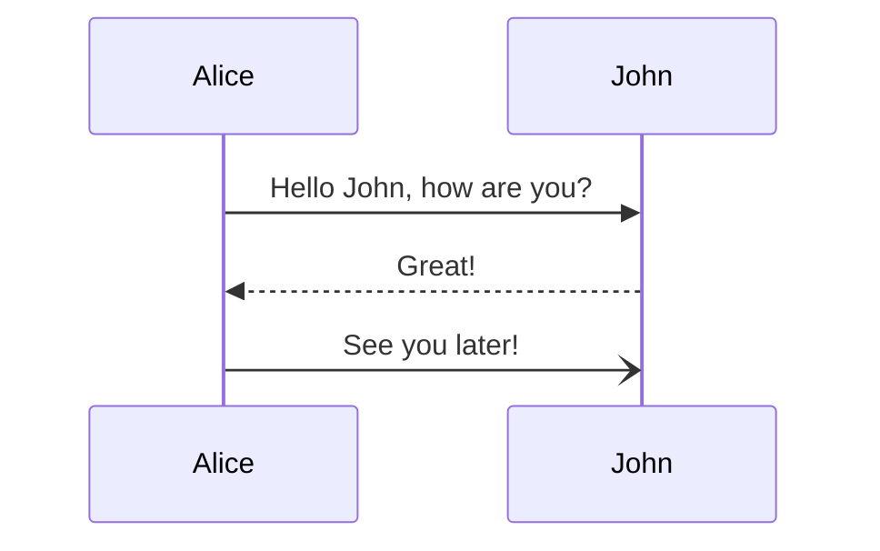

## TL;DR

## Progress

I developed the first interface, which is the foundation of the whole interaction with the website: importing data.

- The first button opens a new tab with a specially crafted Nintendo account login URL. I'll explain in a further section what's special about the URL, but for now it's not relevant.
- Since it's not easy to explain what the user should do, I included a screenshot of what they should see and do.
- Finally, there's an input to paste another special URL (that was copied from the Nintendo Account page) and a button to submit.

Pretty simple. It's not the prettiest, but it does the job. It's built and styled with Tailwind CSS and React, although React is doing nothing special for now.

Once the "import" button is clicked, there are a whole bunch of HTTP Requests to Nintendo's servers that have to be made until we can finally request the gear data. The flow is something like this:

## What is CORS?

