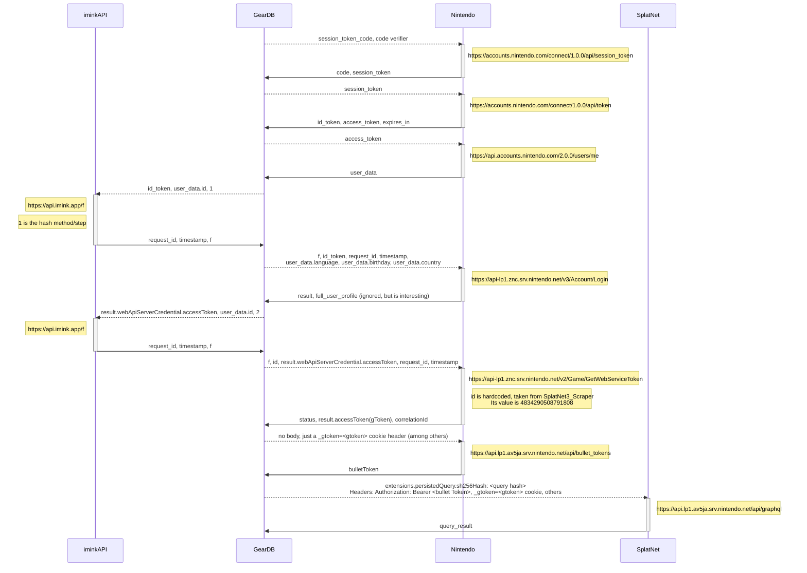

## TL;DR

To retrieve the Splatoon Gear Data, a bunch of HTTP requests have to be made. These can't be performed in a static frontend due to CORS - a backend is necessary. This post describes how I reached this conclusion, and offers an overview of the whole web of requests, from authentication to finally retrieving data.

## Progress

I developed the first interface, which is the foundation of the whole interaction with the website: importing data.


- The first button opens a new tab with a specially crafted Nintendo account login URL. I'll explain in a further section what's special about the URL, but for now it's not relevant.
- Since it's not easy to explain what the user should do, I included a screenshot of what they should see and do.
- Finally, there's an input to paste another special URL (that was copied from the Nintendo Account page) and a button to submit.

Pretty simple. It's not the prettiest, but it does the job. It's built and styled with Tailwind CSS and React, although React is doing nothing special for now other than handling clicks.

## How making requests works

Some resources that helped me understand this part, which is really the core of the project - retrieving data!

- [Mathew Chan's "Intro to Nintendo Switch Rest API"](https://dev.to/mathewthe2/intro-to-nintendo-switch-rest-api-2cm7)
- [s3s, a Python program to retrieve data and upload to a website](https://github.com/frozenpandaman/s3s)
- [SplatNet3_Scraper, another Python program to achieve the same](https://github.com/cesaregarza/SplatNet3_Scraper). Very well built, with detailed comments. Not recommended for beginners that don't know where to look, but once you do, it's great for understanding how to create the requests.

The first step is to generate a special login URL. This url has the following format:

```
https://accounts.nintendo.com/connect/1.0.0/authorize?
  state=<state>
  &redirect_uri=npf71b963c1b7b6d119://auth&client_id=71b963c1b7b6d119
  &scope=openid%20user%20user.birthday%20user.mii%20user.screenName
  &response_type=session_token_code
  &session_token_code_challenge=<challenge>
  &session_token_code_challenge_method=S256&theme=login_form
```

We have to fill in the `<state>` and the `<challenge>` variables:
- `state`: a string of 36 random bytes, base64 encoded
- `challenge`: a SHA256 hash of a string of 32 random bytes, base64 encoded.

An important note is that the string of 32 random bytes of the challenge must be stored somewhere: we'll call it the `code verifier`.

Once the users click on the generated URL and login, they copy the link from the "Select this person" button and paste it back on our interface. This is a bit tricky, but there's no other way from what I've researched. The URL they paste has the following format:

```
npf71b963c1b7b6d119://auth#session_state=<returned session state>
&session_token_code=<JSON Web Token>
&state=<state>
```

The important variable here is the `session_token_code` - this is what we'll start our subsequent requests with.

From this point forward, no user interaction should be needed. The website must handle all the subsequent steps, which are quite a few. I've illustrated them below:




- The query hashes can be found in [SplatNet3_Scraper's project](https://github.com/cesaregarza/SplatNet3_Scraper/blob/554bb98280b73d21b7efdb0b2209eb05af12b68e/splatnet3_scraper/constants.py#L19).
- All requests are POST and have more headers which I haven't been able to fit here. The SplatNet3_Scraper has all of them in various files and is the best resource to retrieve them.

I haven't found a better way of visualizing this. It looks quite bad on smaller screens, sorry for that! But unfortunately, it is quite a long series of requests. It's not hard to implement, but it will require a lot of error handling. The `session_token` only expires after 2 years, but the others have shorter life spans: the bullet token expires every 2 hours, and the gtoken every 6.5 hours. The iminkAPI is sometimes down. The requests may fail due to Nintendo changing their rules. **For a good user experience, the refreshes must be seamless, and any error responses must be handled gracefully.**

With all of this logic understood, I started implementing the first request using the [fetch API](https://developer.mozilla.org/en-US/docs/Web/API/Fetch_API) and it immediately failed due to CORS errors. The dreaded `has been blocked by CORS policy`. What a start!

Was I crafting the request wrong? From the browser's developer tools network tab, it's possible to copy a request as `curl`, so that it can be executed in a terminal. And on a terminal it worked. It also worked on Postman. And it worked on two of the Python programs I listed above. So what's going on?


## What is CORS?

From [MDN](https://developer.mozilla.org/en-US/docs/Web/HTTP/CORS):

> Cross-Origin Resource Sharing (CORS) is an HTTP-header based mechanism that allows a server to indicate any origins (domain, scheme, or port) other than its own from which a browser should permit loading resources.

And there's an additional restriction:

> For security reasons, browsers restrict cross-origin HTTP requests initiated from scripts. For example, XMLHttpRequest and the Fetch API follow the same-origin policy. This means that a web application using those APIs can only request resources from the same origin the application was loaded from unless the response from other origins includes the right CORS headers.

Since Nintendo's server didn't allow anyone to make requests, and the API is not in localhost (same origin)... our browser blocks the request.

This is a useful feature for security purposes, and one that I totally forgot about. A backend API could be protected so that only a specific domain could make requests to it; that way, no websites other than the authorized frontend could access the API. But this completely breaks my initial plan of building a static website. Now, a backend is required - the Python programs work because requests outside the browser are not subject to CORS rules. The frontend would make a request to my backend, and my backend would then make the necessary requests to Nintendo, handle responses, and reply to the frontend.

This adds more complexity than I initially antecipated and wanted for an MVP. However, there's no way around this if I want to import data automatically, so it is what it is.

## Next steps

The fastest way to ship this project would be to leverage one of the existing projects as a backend server. For example, I could wrap `SplatNet3_Scraper` with something like [FastAPI](https://fastapi.tiangolo.com/) or [Django](https://www.djangoproject.com/), and make requests to this using a frontend. Or I could use Django as a server-side frontend renderer, and make use of out of the box session and user management. All of the refreshes, error handling, and queries are already being handled by the library, which would allow me to focus on the development of the interesting parts of the product. This is what I would choose if I were building something for monetization.

On the other hand, I would like to learn and have experience with modern technologies like NextJS, React, and TypeScript. I have no time constraints and no expectations of making money with this, so I would prefer to stick with what I want to learn. I found [nxapi](https://github.com/samuelthomas2774/nxapi), a library for Node that could potentially allow me to keep using these technologies while still benefitting from an already made project. What I don't like about this is that the documentation is not great - I have spent some time looking at it and still didn't understand how to use it. I'll most likely experiment with this first, and then decide on further steps.

Since now I need to use a backend, the [t3 stack](https://create.t3.gg/) seems to fulfill all my requirements:

- Has a type-safe API using TypeScript and tRPC, with everything already configured
- Has support for NextAuth
- Has support for Prisma, a database ORM
- Allows for easy deploys in various platforms
- Has great documentation

Other frameworks are also interesting, like [Remix](https://remix.run/). However, I don't foresee the progressive loading being super useful for this app since my vision is not a page full of independent components. Without using this, I don't see a point in going for Remix (but I could be wrong, of course).

The next post will have implementation details of this request fiesta, and how I re-architected the application.
