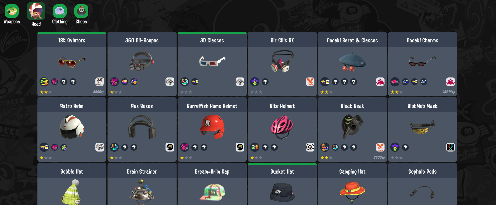
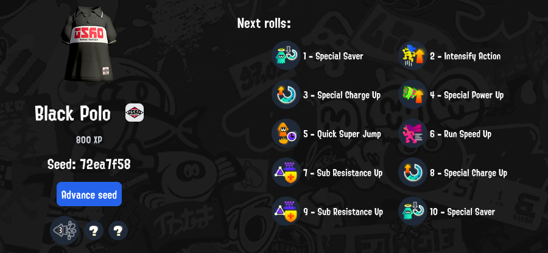

import { Image } from 'astro:assets';
import poster from '/public/images/posts/splatoon-gear-series/1-motivation/splatoon_promo.jpg';

## TL;DR

The most used tool in the Splatoon community for managing the game's inventory suffers from a few design issues. It's not intuitive, it requires a lot of manual effort, and it could be prettier. I built a better website with NextJS:

## Introduction

Splatoon is a competitive shooter game series released by Nintendo. It features cute human-octupus and human-squid mixed characters that shoot at each other with ink. There have been 3 games released so far.

<Image class="float-right w-[600px] ml-12 not-prose" src={poster} alt="Splatoon promo image" />

One of the key mechanics of the game is **gear**. Players can choose to equip their characters with different head gear (like glasses, hats, masks), clothing gear (shirts, jackets, armor) and shoes (sandals, crocs, boots, slippers). This changes their look, and most importantly, affects the **gameplay**, as each gear piece can be loaded with distinctive abilities. These are random, but the randomness comes from a seed. If you find the seed, you can get the gear piece you want with the abilities you want.

## Building gear

A very popular website for finding a seed is Leanny's website, at https://leanny.github.io. This website allows you to track the gear you own, and find a particular piece's seed by having you input what random abilities you obtain on that piece as you play. Given the seed, it also tells you what steps you have to take to arrive at a desired ability set:

There are, however, some usability problems with the website:

1. Importing the gear is done in a complicated way:
    - DM a Discord bot to ask for a special link
    - Open that link, and login to your the Nintendo Account
    - Copy a link on the account page
    - Send it to the bot
    - The bot replies with a `json` file
    - You upload the file to Leanny's website
2. The whole process has to be repeated whenever a new piece of gear is obtained.
3. You have to keep track of seeds somewhere else - updating the gear wipes the seeds.
4. You also have to keep track of the abilities unlocked and their order somewhere else, since a gear update wipes this as well.
5. There are no accounts, so there is no data sync. You can't plan the abilities you want on the gear you want on your PC, and then check that information on your phone. At least personally, my computer is far from my TV, and I play Splatoon on my TV. You know what I have near me when I'm on my TV? My phone. Considering that there is a manual process to register new abilities unlocked on a gear piece for seed prediction, doing it on a phone would make my life much easier.

## Solution

Features of what I built:

- Fetch and browse your own weapons and gear in Splatoon 3:

    
  

- View weapon stats:

  

- Find out the next abilities that will be granted for an unused gear piece:

  

- Recover the seed of a gear you have already played with, to also find out what will be
unlocked next.

- When your gear has a seed associated, you can create your desired build, and get step-by-step instructions on how to reach it with checkmarks to register progress:

  

- Refresh all your gear and weapon data with a simple button press.
- Synchronize your whole data by logging in with a Discord account, and access it anywhere.

## What's next?

Unfortunately the website isn't public yet. I am not yet satisfied with the performance and some of the choices I made in terms of usability and sync abilities. Also, this is a brittle setup: an update by Nintendo to their API version can immediately break the website. I kept meaning to create some automations to avoid this, but alas... priorities.

Nevertheless, it was an awesome project that legitimately helped me playing Splatoon, and helped me learn NextJS, so I consider it a success.